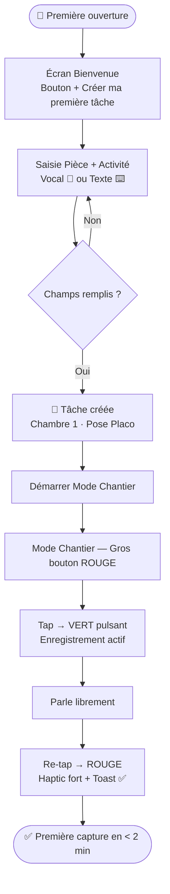
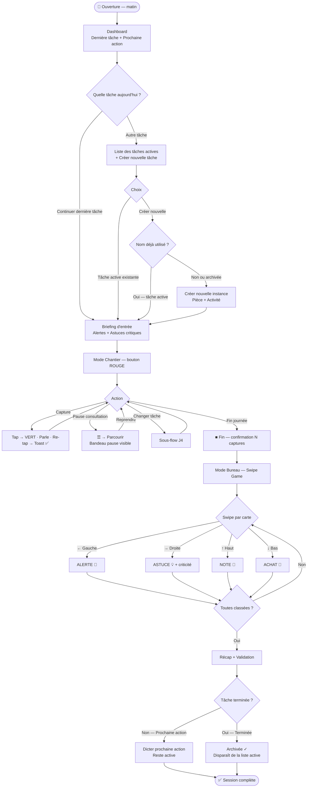
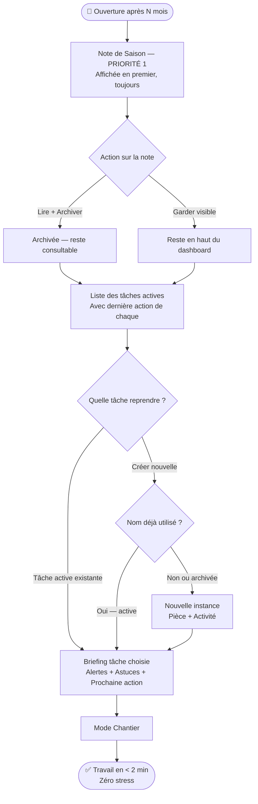
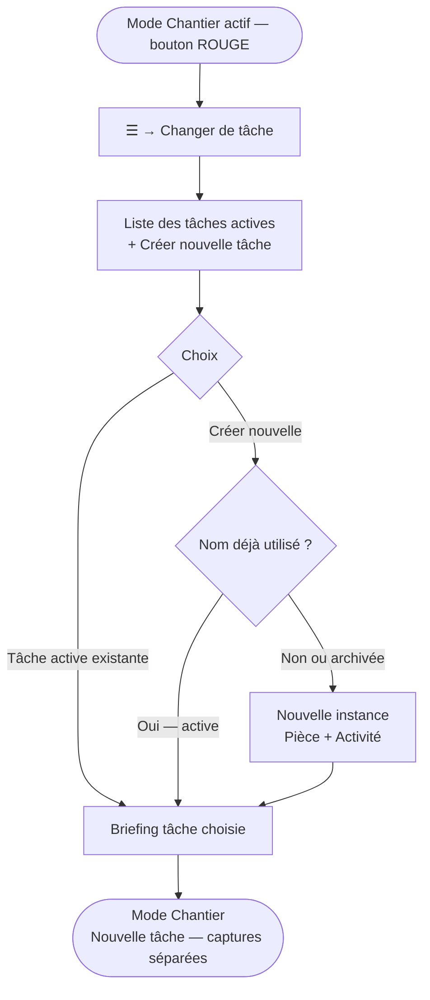
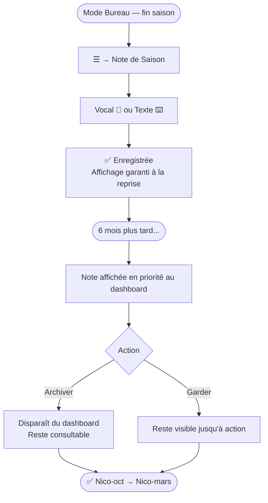

# UX Design Specification — Gestion Travaux

**Author:** Nico
**Date:** 2026-02-21

---

<!-- UX design content will be appended sequentially through collaborative workflow steps -->

## Executive Summary

### Project Vision

Gestion Travaux est un "second cerveau de chantier" pour bricoleurs amateurs qui rénovent sur de longues durées avec des pauses saisonnières de mois, voire d'années. Sa proposition de valeur est **inversée** par rapport aux apps classiques : la valeur ne dérive pas de la fréquence d'usage, mais du **désir de rouvrir après une longue absence**. L'app doit être irrésistible à réouvrir sans notifications ni rappels — uniquement par la qualité du contenu structuré qu'elle restitue.

Deux composantes interdépendantes portent cette vision :
1. **Capture sans friction** pendant les périodes actives (Mode Chantier — voice-first, gros bouton)
2. **Architecture d'information de qualité** qui rend la réouverture irrésistible après de longues pauses (ALERTES, ASTUCES, Prochaine Action, Briefing de reprise)

### Target Users

**Utilisateur principal — Nico, 42 ans, le Bricoleur Concrétiseur**
- Cadre dans le secteur tertiaire, besoin de concret pour contrebalancer un travail abstrait
- Rénove une maison à la campagne sur ses week-ends et vacances, pauses hivernales de 6-12 mois
- Travail principalement solo, parfois aidé de sa compagne ou d'amis
- Problème actuel : 27 notes Apple Notes disparates, 2 heures pour retrouver une information critique avant de reprendre le chantier
- Niveau tech : intermédiaire, iPhone natif, à l'aise avec les apps mobiles modernes

**Utilisateurs secondaires**
- La compagne : consultation des alertes, ajout de captures lors de sessions communes, réception de fiches pratiques
- Amis bricoleurs : partage de fiches activité, compréhension rapide du contexte avant de venir aider

### Key Design Challenges

1. **Double personnalité radicale** : Mode Terrain (écran noir, 1 gros bouton, économie batterie maximale) vs Mode Bureau (interface riche, swipe gestures, classification). Ces deux modes doivent coexister dans la même app sans créer de confusion cognitive ni d'effort de transition.

2. **Zéro friction absolue sur le terrain** : Interface utilisable les mains sales ou avec des gants (touch targets ≥ 60×60 pts), en plein soleil comme en pénombre, actionnable d'une seule main, sans regarder l'écran. Chaque milliseconde de friction supplémentaire est un risque d'abandon de capture.

3. **Architecture d'information "irrésistible" après une longue pause** : Le Briefing de reprise doit reconstituer 100% du contexte mental en < 2 minutes, avec une hiérarchie fractale (vue hélicoptère → zoom) navigable en ≤ 1 interaction. La qualité du contenu restitué doit elle-même motiver la réouverture.

4. **Classification rapide et intuitive** : Le tri du soir (Mode Bureau) doit traiter toutes les captures en 2-5 minutes via swipe game fluide — 4 directions pour 4 types de contenu — sans charge cognitive.

5. **Onboarding quasi-inexistant** : Opérationnel en < 2 minutes dès la première utilisation, première capture possible immédiatement, sans tutoriel.

### Design Opportunities

1. **L'écran du Mode Chantier comme objet de confiance** : Le gros bouton rouge qui pulse en vert peut devenir une expérience presque sensorielle — feedback haptique + visuel fort = sentiment de maîtrise totale. "Mon chantier m'écoute."

2. **Le Briefing de reprise comme moment émotionnel fort** : Retrouver après 8 mois exactement là où on s'était arrêté est une expérience potentiellement très satisfaisante. Ce "moment aha!" est le cœur différenciateur de l'app — il mérite un soin visuel et narratif particulier.

3. **La classification par swipe comme "swipe game" gratifiant** : L'analogie avec un jeu de cartes (swipe direction = destination) peut rendre le tri du soir presque ludique — une récompense après la journée de travail, pas une corvée administrative.

## Core User Experience

### Defining Experience

La boucle de valeur centrale de Gestion Travaux repose sur **deux actions cœur interdépendantes** :

1. **Sur le terrain — le Tap-to-Toggle** : Un tap rouge → vert déclenche l'enregistrement. Les mains sont libres. L'utilisateur parle, intercale des photos à volonté. Un second tap arrête et sauvegarde le bloc. C'est l'action la plus fréquente, la plus critique, utilisable mains sales, tête ailleurs.

2. **Le soir — le Swipe Game** : Classification par swipe des captures de la journée en 2-5 minutes. Simple, rapide, satisfaisant. C'est la transformation du chaos capturé en mémoire structurée.

Si l'une des deux est cassée, l'ensemble du système s'effondre.

### Platform Strategy

iOS natif exclusivement (Swift + SwiftUI, iOS 18+, iPhone uniquement), 100% offline, stockage local. Aucun cloud, aucun backend, aucun support Android en MVP.

Capacités natives exploitées :
- **Speech-to-text natif iOS** (AVSpeechRecognizer) — pas de service tiers, économie batterie et réseau
- **Haptic Engine** — retour tactile pour chaque action critique
- **AVAudioSession** — enregistrement audio continu pendant la prise de photo
- **Portrait uniquement** — pas de rotation accidentelle sur le chantier
- **iOS Data Protection** — chiffrement automatique au repos

### Effortless Interactions

| Action | Contrainte terrain | Exigence UX |
|--------|-------------------|-------------|
| Démarrer une capture | Mains sales, tête ailleurs | 1 tap, bouton géant, feedback haptique + visuel immédiat |
| Parler librement | Mains occupées | Mains libres pendant tout l'enregistrement (tap-to-toggle) |
| Prendre une photo | Sans interrompre la voix | 1 tap sur bouton secondaire, audio ininterrompu |
| Changer de tâche | En plein milieu de session | ≤ 5 secondes, sans quitter le mode chantier |
| Classifier une capture | Le soir fatigué | Swipe intuitif, < 5 min pour toute la session |
| Retrouver le contexte | Après 8 mois d'absence | ≤ 2 minutes, structure immédiatement lisible |

### Critical Success Moments

**Moment 1 — La Première Capture :** Nico pose l'app, crée sa première tâche, tape le gros bouton et parle en < 2 minutes sans tutoriel. Si c'est naturel, l'app a gagné.

**Moment 2 — La Réouverture après 8 mois :** L'app s'ouvre, les alertes critiques + astuces + prochaine action sont là, immédiatement. Nico n'a pas à chercher. Ce moment doit être émotionnellement satisfaisant — "mon chantier m'attendait".

**Moment 3 — Le Tri du Soir :** 12 captures classifiées en 3 minutes de swipes fluides. Un "done !" satisfaisant, pas une corvée administrative.

**Moment Critique à NE PAS Rater — L'Interruption :** Appel entrant, consultation rapide de fiche — le mode chantier se met en pause proprement (bandeau "Mode Chantier en pause | Reprendre") et reprend instantanément. Si ce flow casse, la confiance s'effondre.

### Experience Principles

1. **"Capture d'abord, classe ensuite"** — Zéro charge cognitive sur le terrain. L'intelligence est différée au calme du soir.
2. **"La friction est l'ennemi absolu"** — Chaque interaction en Mode Chantier fonctionne d'une seule main, mains libres pendant l'enregistrement, quelle que soit la condition physique.
3. **"L'app doit mériter qu'on la rouvre"** — La valeur créée pendant une session est si bien structurée qu'elle motive organiquement la réouverture, sans notifications.
4. **"Le passé protège le futur"** — L'interface révèle immédiatement ce que le Nico du passé a jugé critique. La hiérarchie ALERTE → ASTUCE → Note respecte cette logique de protection temporelle.
5. **"Portrait, sombre, grand"** — Mode Chantier en portrait uniquement, fond sombre, éléments tactiles larges (≥ 60×60 pts). Lisible en plein soleil, utilisable avec des gants.

## Desired Emotional Response

### Primary Emotional Goals

L'émotion centrale à créer est la **confiance tranquille** — l'exact opposé de la peur permanente d'oublier quelque chose que vit Nico aujourd'hui avec ses 27 notes Apple Notes disparates.

> *"Je n'ai pas peur d'oublier — l'app se souvient pour moi."*

L'émotion différenciatrice, qu'aucune autre app ne peut créer pour ce cas d'usage : **la sérénité face à la discontinuité**. Nico peut lâcher prise parce que l'app tient le fil. Ce sentiment — "je peux partir des mois sans stresser" — est le véritable différenciateur émotionnel de Gestion Travaux.

### Emotional Journey Mapping

| Moment | Émotion cible | Émotion à éviter |
|--------|--------------|-----------------|
| **Premier lancement** | Curiosité + soulagement ("enfin quelque chose fait pour moi") | Overwhelm, confusion |
| **Première capture** | Légèreté, fluidité ("c'est vraiment aussi simple ?") | Hésitation, friction ressentie |
| **Pendant la session terrain** | Focus, maîtrise ("mon chantier m'écoute") | Distraction, anxiété de manipulation |
| **Tri du soir** | Satisfaction, accomplissement ("tout est propre, rien n'est perdu") | Corvée, ennui |
| **Réouverture après 8 mois** | Reconnaissance, soulagement profond ("il s'est souvenu de tout") | Désorientation, sentiment de perte |
| **Consultation d'une alerte** | Confiance ("le Nico du passé m'a protégé") | Doute, méfiance envers l'info |
| **Si quelque chose se passe mal** | Sécurité ("rien n'est perdu, l'app a géré") | Panique, sentiment de trahison |

### Micro-Emotions

- **Confiance vs. Méfiance** — Chaque élément de l'interface doit signaler fiabilité. Si Nico doute une seule fois que l'app a bien sauvegardé, le pacte est brisé.
- **Maîtrise vs. Dépendance** — L'app guide sans imposer. L'utilisateur reste le chef de son chantier, l'app est son assistant fidèle, pas son patron.
- **Légèreté vs. Lourdeur** — Le Mode Chantier doit disparaître derrière la tâche. Si l'interface se remarque, c'est qu'elle a échoué.
- **Satisfaction vs. Frustration** — Le swipe game du soir doit avoir la même satisfaction qu'effacer une TODO list. Chaque swipe = un point de moins dans l'anxiété.
- **Reconnaissance vs. Abandon** — À la réouverture, l'app doit avoir l'air de "te connaître" — pas d'un outil froid qui affiche des données.

### Design Implications

- **Confiance → Feedback systématique** : Chaque tap, chaque sauvegarde, chaque classification confirmée par un retour haptique + visuel. Le silence de l'app est toujours anxiogène.
- **Maîtrise → Hiérarchie claire, pas de surprises** : L'utilisateur sait toujours où il est, ce qui est sauvegardé, ce qui reste à faire. Aucune navigation cachée, aucun état ambigu.
- **Légèreté → Interface qui s'efface** : Mode Chantier = fond sombre, 1 bouton, rien d'autre. L'attention reste sur le travail, pas sur l'app.
- **Satisfaction → Progressions visibles** : Voir les captures s'accumuler, les swipes réduire la pile, les alertes se résoudre. La progression est toujours tangible.
- **Reconnaissance → Le Briefing de reprise comme moment narratif** : Pas une liste froide de données — un accueil structuré et chaleureux, presque comme une lettre du soi passé.

### Emotional Design Principles

1. **"L'app qui ne trahit jamais"** — Zéro perte de données = zéro rupture de confiance. La fiabilité technique est une exigence émotionnelle autant que technique.
2. **"L'assistant, pas le patron"** — L'app propose, guide, structure. Mais Nico décide toujours. Aucun workflow imposé, aucune contrainte cachée.
3. **"Le silence est anxiogène"** — Toute action critique produit un feedback immédiat (haptique + visuel). Ne jamais laisser Nico se demander "ça a bien marché ?"
4. **"Mérite d'être rouverte"** — Chaque session doit laisser un artefact de valeur (alertes, astuces, prochaine action) qui rend la prochaine réouverture attirante, pas redoutée.

## UX Pattern Analysis & Inspiration

### Inspiring Products Analysis

**Profil utilisateur :** Nico utilise intensément Apple Notes et Apple Rappels, n'a jamais essayé d'app dédiée aux travaux, et a abandonné Notion malgré sa puissance reconnue — coût d'entrée trop élevé, complexité perçue trop forte.

Il est un **utilisateur natif iOS profond** : il gravite naturellement vers des apps qui disparaissent derrière la tâche, sans configuration, sans apprentissage, sans friction d'entrée.

#### Apple Notes — "Zéro friction, zéro structure"

Ce qui marche :
- Ouvre l'app → curseur qui clignote → on tape. Rien d'autre.
- Pas de catégorie obligatoire, pas de template, pas de dossier requis
- Interface native iOS : elle semble faire partie du téléphone, pas d'une app tierce
- Recherche plein texte instantanée, sans organisation préalable

Enseignement : La philosophie "valeur immédiate sans setup" — la première capture dans Gestion Travaux doit être aussi directe que taper dans Notes. Ce qu'on dépasse : Notes n'a aucune intelligence. Tout est plat. C'est exactement le problème résolu par Gestion Travaux.

#### Apple Rappels — "La satisfaction du check"

Ce qui marche :
- Créer un rappel = 1 action, résultat visible immédiatement
- Cocher une tâche = satisfaction tactile + visuelle (item coché, feedback haptique natif)
- Listes propres, hiérarchie simple et visible
- Feedback haptique natif iOS sur chaque interaction

Enseignement : La **check satisfaction** — quand Nico swipe pour classifier ou résout une alerte, la satisfaction doit être aussi nette que cocher dans Rappels. La hiérarchie simple (Listes → Items) résonne avec le modèle MAISON → PIÈCES → TÂCHES.

#### Notion — "L'anti-pattern à éviter absolument"

Pourquoi abandonné :
- Page blanche au démarrage : trop de liberté = paralysie
- Setup avant valeur : il faut configurer des bases de données AVANT de pouvoir noter quelque chose d'utile
- Coût cognitif d'apprentissage : nouveau vocabulaire (Databases, Views, Relations…)
- Meta-travail : on passe plus de temps à organiser le système qu'à l'utiliser

Enseignement inverse : Gestion Travaux ne demande jamais de configuration préalable. La valeur est accessible dès la première interaction.

### Transferable UX Patterns

| Pattern | Source | Application dans Gestion Travaux |
|---------|--------|----------------------------------|
| Valeur immédiate sans setup | Apple Notes | Première capture en < 2 min, 0 configuration |
| Interface "native iOS" invisible | Notes + Rappels | Design system Apple HIG, composants natifs SwiftUI |
| Check satisfaction haptique | Rappels | Swipe de classification + résolution d'alerte avec feedback fort |
| Hiérarchie simple et visible | Rappels | MAISON → PIÈCES → TÂCHES, position toujours visible |
| Pas de page blanche | Anti-Notion | Premier lancement guidé avec un seul choix clair |

### Anti-Patterns to Avoid

- ❌ **La page blanche** — jamais d'écran vide sans action évidente
- ❌ **Le setup avant la valeur** — aucune configuration requise avant la première capture
- ❌ **Le vocabulaire étranger** — pas de jargon technique, des mots du chantier
- ❌ **La liberté paralysante** — toujours une action suggérée, un chemin proposé
- ❌ **L'interface qui se remarque** — si Nico pense à l'app pendant qu'il travaille, c'est raté

### Design Inspiration Strategy

**Adopter** : L'esthétique et la philosophie native iOS de Notes/Rappels — épuré, familier, sans apprentissage. Composants natifs SwiftUI, conventions iOS respectées, rien qui surprend.

**Adapter** : La satisfaction du "check" de Rappels → transformée en satisfaction du "swipe" pour la classification, et du "resolve" pour les alertes. Même dopamine, nouvelle mécanique.

**Inventer** : Le Mode Chantier tap-to-toggle et le Briefing de reprise n'ont pas d'équivalent dans les apps connues de Nico — c'est le territoire neuf et différenciateur de Gestion Travaux.

## Design System Foundation

### Design System Choice

**Option retenue : Apple HIG + SwiftUI natif comme fondation, avec composants custom ciblés uniquement là où l'expérience le justifie.**

Ni un custom design system complet (trop coûteux pour un dev solo en apprentissage), ni un natif pur (certaines interactions différenciantes nécessitent un traitement sur-mesure) — mais une approche hybride pragmatique.

### Rationale for Selection

- **Utilisateur native iOS** : Nico utilise Notes et Rappels — l'esthétique et les conventions iOS lui sont transparentes. Une app qui "ressemble à iOS" est immédiatement familière, sans courbe d'apprentissage.
- **Dev solo en apprentissage Swift/SwiftUI** : Les composants natifs SwiftUI réduisent la charge de développement et permettent de se concentrer sur les interactions différenciantes.
- **Accessibilité et qualité gratuits** : Dark Mode, Dynamic Type, VoiceOver, Haptic Engine — tout fourni par le framework sans effort supplémentaire.
- **Performance optimale** : Composants natifs = performances système optimales, critique pour le Mode Chantier (batterie, réactivité).

### Implementation Approach

**Fondation native (HIG + SwiftUI) pour :**
- Navigation (NavigationStack, TabView, sheets, modales)
- Listes et hiérarchies (List, LazyVStack, NavigationLink)
- Formulaires et saisie (TextField, Form, Picker)
- Feedback système (alerts, confirmations, toasts)
- Typographie et espacement (Dynamic Type natif)
- Couleurs système (accent color, semantic colors, Dark Mode automatique)

**Composants custom ciblés pour :**
- **Le Gros Bouton** (rouge/vert, animations d'état, feedback haptique spécifique, layout plein écran)
- **Le Swipe Classifier** (4 directions, sous-menu criticité astuces, récapitulatif de session)
- **La Briefing Card** (présentation hiérarchique alertes + astuces critiques + prochaine action)
- **L'écran Mode Chantier** (fond sombre, layout ultra-minimaliste, mode économie batterie)

### Customization Strategy

Approche "native d'abord, custom par exception" :
1. Toujours chercher le composant SwiftUI natif existant en premier
2. N'implémenter un composant custom que si le natif ne peut pas répondre au besoin UX
3. Les composants custom respectent les conventions HIG (tailles de touch targets, animations, couleurs sémantiques)
4. Design tokens partagés (couleurs, rayons, espacements) définis une seule fois et réutilisés partout

## 2. Core User Experience

### 2.1 Defining Experience

L'expérience définissante de Gestion Travaux est une **boucle Capture-Retrouve** en deux temps liés :

> *"Tape le bouton, parle, et retrouve tout exactement là où tu en étais — même 8 mois plus tard."*

Si l'un des deux temps est raté, l'autre perd sa raison d'être. La capture sans retrieval de qualité n'a aucune valeur. Le retrieval sans capture facile n'a rien à restituer.

### 2.2 User Mental Model

Nico utilise déjà Apple Notes comme un "vide-poche vocal-textuel". Son modèle mental actuel : *"Je dois noter quelque chose quelque part… que je retrouverai peut-être."*

Gestion Travaux ne change pas ce modèle — il le complète : *"Je tape, je parle, et l'app s'occupe du reste. Quand je reviens, tout est là, structuré, sans que j'aie rien fait de plus."*

La friction existe déjà dans son workflow. Ce qu'on supprime : l'anxiété du "est-ce que je retrouverai ?" et les 2h de recherche frustrante.

### 2.3 Success Criteria

- ✅ Nico capture sa première note en < 30 secondes sans aide
- ✅ Il sait toujours en un coup d'œil si l'app enregistre ou pas (rouge = inactif, vert pulsant = actif)
- ✅ Il ne se demande jamais "est-ce que ça a bien sauvegardé ?" (toast de confirmation systématique)
- ✅ Après 8 mois, il retrouve ses infos critiques en < 2 minutes
- ✅ Il décrit l'app à un ami avec ces mots : *"Je tape le bouton, je parle, et ça se souvient de tout"*

### 2.4 Novel UX Patterns

**Patterns établis (familiers pour Nico) :**
- Listes avec hiérarchie → même logique que Notes/Rappels
- Tap pour action primaire → universel iOS
- Swipe pour actions secondaires → natif iOS

**Patterns nouveaux :**
- **Tap-to-toggle vocal** — une pression = on, une pression = off. Métaphore d'interrupteur vocal. Enseigné par le visuel seul (rouge/vert pulsant), sans tutoriel.
- **Swipe 4 directions avec labels permanents** — directions toujours visibles sur les 4 bords, label s'illumine pendant le geste pour confirmer. Appris en une session.

**Stratégie d'apprentissage :** Aucun tutoriel. Le contexte visuel enseigne tout. Rouge = stop. Vert qui pulse = écoute. Labels sur les bords = swiping guidé.

### 2.5 Experience Mechanics

#### Capture (Mode Chantier)

| Étape | Ce que fait Nico | Ce que fait l'app |
|-------|-----------------|-------------------|
| **Initiation** | Lance le Mode Chantier | Demande : "Dans quelle pièce ?" + "Quelle activité ?" — crée la tâche automatiquement si inexistante |
| **Accès au bouton** | Confirme la tâche | Écran Mode Chantier : gros bouton rouge dominant, tout le reste effacé |
| **Tap** | Appuie une fois, relâche | Bouton passe au **vert pulsant** (pulse continu = enregistrement actif), feedback haptique léger |
| **Parle** | Parle librement, intercale photos | Transcription temps réel visible, pulse visuel confirme capture active |
| **Re-tap** | Appuie à nouveau, relâche | Bouton repasse rouge, **feedback haptique fort** + **toast** "✅ Capture sauvegardée" |
| **Répète** | Enchaîne une nouvelle capture | Prêt immédiatement, même tâche contextuelle |

#### Classification (Swipe Game — Mode Bureau)

Mapping des directions (définitif) :

```
                ┌─────────────────────────┐
                │       📝 NOTE           │  ← swipe haut
                │                         │
🚨 ALERTE →    │   [Carte de capture]    │    ← 💡 ASTUCE
                │                         │
                │       🛒 ACHAT          │  ← swipe bas
                └─────────────────────────┘
```

- **Gauche → Alerte 🚨** : danger, point critique (côté "stop/attention")
- **Droite → Astuce 💡** : bonne pratique, savoir-faire (côté "go/avancer")
- **Haut → Note 📝** : contexte général, archiver
- **Bas → Achat 🛒** : envoyer vers liste de courses

Labels permanents sur les 4 bords, visibles avant de swiper. Label s'illumine pendant le geste pour confirmer la direction. Appris sans tutoriel en 30 secondes.

#### Retrouve (Briefing de reprise)

| Étape | Ce que fait Nico | Ce que fait l'app |
|-------|-----------------|-------------------|
| **Ouverture** | Lance l'app après N mois | Détecte l'absence, affiche le dashboard de reprise |
| **Lecture** | Parcourt le briefing | ALERTES 🚨 en priorité → ASTUCES critiques 💡 → Prochaine Action ▶️ |
| **Drill-down** | Tape une alerte | Note originale complète (transcription + photo) en ≤ 1 tap, ≤ 500ms |
| **Décision** | Choisit par où commencer | L'app propose la dernière tâche + son état |
| **Action** | Lance le mode chantier | Contexte reconstitué, prêt à travailler |

## Visual Design Foundation

### Color System

**Direction retenue : Acier Discret** — sobre, tech, Apple-like. Bleu nuit acier comme accent, blanc cassé chaud pour le mode bureau.

**Couleurs de fond :**

| Rôle | Valeur | Usage |
|------|--------|-------|
| Background Chantier | `#0C0C0E` | Écran Mode Chantier uniquement |
| Background Bureau | `#F8F6F2` | Toute la navigation, listes, briefings |
| Background Card | `#EFEEED` | Cartes, cellules de liste sur fond Bureau |
| Background Chantier Card | `#1C1C1E` | Éléments sur fond sombre (menu hamburger) |

**Accent & Navigation :**

| Rôle | Valeur | Usage |
|------|--------|-------|
| Accent principal | `#1B3D6F` | Navigation tint, boutons CTA, liens actifs |
| Texte primaire | `#1C1C1E` | Corps de texte principal (iOS standard) |
| Texte secondaire | `#6C6C70` | Métadonnées, dates, labels secondaires |
| Séparateurs | `#E5E3DF` | Lignes de séparation sur fond Bureau |

**Couleurs sémantiques fonctionnelles :**

| Élément | Couleur | Hex |
|---------|---------|-----|
| Bouton inactif (rouge) | iOS Red | `#E53E3E` |
| Bouton actif pulsant (vert) | Apple Green | `#34C759` |
| ALERTE 🚨 | Rouge système | `#FF3B30` |
| ASTUCE Critique 🔴 | Orange système iOS | `#FF9500` |
| ASTUCE Importante 🟡 | Jaune système iOS | `#FFCC00` |
| ASTUCE Utile 🟢 | Vert système iOS | `#34C759` |
| NOTE 📝 | Gris secondaire | `#6C6C70` |
| ACHAT 🛒 | Accent bleu nuit | `#1B3D6F` |

### Typography System

SF Pro exclusivement (police système iOS) — cohérence native garantie, Dynamic Type automatique, aucune police externe.

| Niveau | Style SF Pro | Taille | Usage |
|--------|-------------|--------|-------|
| Large Title | SF Pro Display Bold | 34pt | Titre dashboard accueil |
| Title 1 | SF Pro Display Semibold | 28pt | Nom de pièce / tâche |
| Title 2 | SF Pro Text Semibold | 22pt | Section headers (ALERTES, ASTUCES) |
| Headline | SF Pro Text Semibold | 17pt | Labels navigation, titres cartes |
| Body | SF Pro Text Regular | 17pt | Corps captures, notes |
| Callout | SF Pro Text Regular | 16pt | Prochaine action |
| Caption | SF Pro Text Regular | 12pt | Dates, métadonnées, compteurs |
| Chantier tâche | SF Pro Text Medium | 15pt | Nom tâche active en haut écran Chantier |

### Spacing & Layout Foundation

Base unit : **8pt** (standard iOS)

| Élément | Valeur |
|---------|--------|
| Marges écran | 16pt |
| Padding interne cartes | 16pt |
| Espacement entre sections | 24pt |
| Espacement entre éléments liste | 12pt |
| Border radius cartes | 12pt |
| Touch targets minimum | 60×60pt (gants) |
| Gros bouton Mode Chantier | 120×120pt minimum |

### Accessibility Considerations

- Contraste WCAG AA minimum sur toutes les combinaisons texte/fond
- Support Dynamic Type natif — toutes les tailles scalent automatiquement
- Dark Mode Bureau géré automatiquement par iOS (semantic colors)
- Mode Chantier dark par conception — pas de switch nécessaire
- Feedback haptique systématique en complément du feedback visuel
- Touch targets ≥ 60×60pt pour utilisation avec gants

## Design Direction Decision

### Direction Choisie : Acier Discret

**Décision validée** après visualisation des maquettes HTML (v3).
**Fichier de référence :** `_bmad-output/planning-artifacts/ux-design-directions.html`

### Mode Chantier — Layout Définitif

| Zone | Contenu |
|------|---------|
| **Haut** | Status (heure, contexte tâche) + Hamburger ☰ en haut à droite |
| **Centre** | Gros bouton dominant (rouge inactif / vert pulsant actif) |
| **Bas** | [📷 Photo] + [■ Fin] côte à côte |

**Comportement du bouton tap-to-toggle :**
1. Tap → bouton passe **vert + pulse continu** — enregistrement actif, mains libres
2. Re-tap → bouton repasse **rouge** + haptic fort + toast "✅ Capture sauvegardée"

### Swipe Classifier — Layout Définitif

**Concept validé : Arcs-croissants aux bords d'écran**

4 fins croissants (~1cm au pic) positionnés aux 4 bords de l'écran, indépendants de la carte centrale. En état neutre : contours gris discrets. En swipe : le croissant correspondant se remplit de la couleur de la catégorie.

**Labels à l'intérieur de chaque croissant :**

| Direction | Label | Orientation | Couleur active |
|-----------|-------|-------------|----------------|
| Gauche | ALERTE | Lettres A-L-E-R-T-E empilées, chaque lettre à l'endroit | Rouge `#FF3B30` |
| Droite | ASTUCE | Lettres A-S-T-U-C-E empilées, chaque lettre à l'endroit | Orange `#FF9500` |
| Haut | NOTE | Texte horizontal | Gris `#6C6C70` |
| Bas | ACHAT | Texte horizontal | Bleu `#1B3D6F` |

**États visuels du classifier :**

- **Neutre** : 4 arcs gris clair, labels gris, carte centrée avec empilement de profondeur
- **Swipe gauche → ALERTE** : croissant gauche rouge (fill + stroke), label ALERTE rouge vif, autres effacés, carte inclinée à gauche + ombre rouge
- **Swipe droite → ASTUCE** : croissant droit orange, label ASTUCE orange vif, carte inclinée à droite + ombre orange
- **Swipe haut → NOTE** : croissant haut gris foncé (symétrique)
- **Swipe bas → ACHAT** : croissant bas bleu (symétrique)

**Feedback carte :** inclinaison + ombre colorée directionnelle — pas de badge overlay (l'arc de couleur suffit comme signal).

## User Journey Flows

### Journey 1 — Première Utilisation

**Contexte :** Première ouverture, sur le chantier. Objectif : première capture en < 2 min.



### Journey 2 — Session de Travail Complète

**Contexte :** Session complète matin → terrain → soir bureau. Inclut choix de tâche en entrée et archivage en sortie.



### Journey 3 — Reprise après Longue Pause

**Contexte :** Retour après N mois. La Note de Saison est TOUJOURS le premier élément affiché.



### Journey 4 — Changement de Tâche en Session

**Contexte :** Changement de contexte en cours de journée, sans sortir du Mode Chantier.



### Journey 5 — Note de Saison

**Contexte :** Fin de saison, message au futur Nico.



### Journey Patterns

**Sous-flow "Sélection de tâche"** *(réutilisé en J2, J3, J4)* :

| Cas | Comportement |
|-----|-------------|
| Nom existant + tâche **active** | Réouvrir cette instance directement |
| Nom existant + tâche **archivée** | Créer une nouvelle instance (table rase) |
| Nom nouveau | Créer une nouvelle instance |

**Cycle de vie d'une tâche :**

`Création → Active → [sessions multiples] → Archivée (irréversible depuis la liste active)`

### Flow Optimization Principles

- **Zéro modal bloquant** pendant le chantier — toast non-bloquant uniquement
- **Contexte persistant** — tâche active toujours visible en haut de l'écran Chantier
- **Décision binaire en fin de débrief** — Prochaine action (reste active) OU Terminée (archivage)
- **Anti-doublon actif** — l'app vérifie avant de créer, jamais deux instances actives du même nom
- **Note de Saison garantie** — toujours premier élément à la reprise, sans action de l'utilisateur
- **Erreurs impossibles > gestion d'erreurs** — offline-first élimine les erreurs de sauvegarde

## Component Strategy

### Composants SwiftUI Natifs (fondation HIG)

| Composant SwiftUI | Usage |
|-------------------|-------|
| `NavigationStack` + `NavigationLink` | Hiérarchie Maison → Pièces → Tâches |
| `List` / `LazyVStack` | Listes tâches, captures, alertes |
| `TextField` + `Form` | Saisie texte (noms pièce/activité) |
| `Button` | CTA standard (Démarrer, Archiver…) |
| `Sheet` / `.overlay` | Menus hamburger, bottom sheets, récap classification |
| `ProgressView` | Barre progression classification |
| `ScrollView` | Briefing, listes longues |
| `.alert` | Confirmations destructives (archiver tâche) |
| `Text` + Dynamic Type | Toute la typographie SF Pro |

### Custom Components

#### BigButton

**Purpose :** Contrôle tap-to-toggle de l'enregistrement vocal — composant central du Mode Chantier.

**États :**

| État | Visuel | Comportement |
|------|--------|-------------|
| `inactive` | Rouge, shadow faible | Tap → bascule en `active` |
| `active` | Vert, pulse réactif à la voix | Pulse ∝ amplitude AVAudioRecorder · Tap → `inactive` |
| `disabled` | Grisé, non-interactif | Pendant chargement initial |

**Pulse réactif à la voix :** `AVAudioRecorder` avec `.meteringEnabled = true` · Timer à ~60fps lit `averagePower(forChannel: 0)` · Valeur normalisée (dBFS → 0..1) drive `scaleEffect` (1.0–1.12) et `opacity` des anneaux externes. Silence = lueur statique. Parole = pulse proportionnel à l'intensité.

**Transitions :** Tap inactive→active : haptic léger + bouton passe vert · Re-tap active→inactive : haptic fort (`UIImpactFeedbackGenerator(.heavy)`) + toast non-bloquant "✅ Capture sauvegardée".

**Accessibilité :** `accessibilityLabel` dynamique "Démarrer enregistrement" / "Arrêter enregistrement" · `accessibilityHint` décrit l'état courant.

---

#### SwipeClassifier

**Purpose :** Interface de classification 4 directions, avec sous-menu criticité pour ASTUCE.

**États :**

| État | Description |
|------|-------------|
| `neutral` | 4 arcs-croissants gris, carte centrée |
| `swiping-[direction]` | Arc correspondant coloré progressivement, carte inclinée + ombre colorée |
| `criticite` | Bottom sheet après swipe ASTUCE confirmé |
| `classified` | Carte disparaît, suivante arrive |

**Sous-menu criticité ASTUCE** (bottom sheet après swipe droite confirmé) :

| Niveau | Couleur | Description |
|--------|---------|-------------|
| **Critique** ⚠️ | Orange `#FF9500` | À consulter avant chaque session |
| **Importante** 💡 | Jaune `#FFCC00` | Bonne pratique à retenir |
| **Utile** ✅ | Vert `#34C759` | Info pratique complémentaire |

**Implémentation :** `DragGesture` → détecte direction + progression · Release au-delà seuil → classification · Swipe droite → bottom sheet criticité · Tap niveau → carte suivante.

**Accessibilité :** Boutons alternatifs pour chaque direction (fallback non-swipe accessible).

---

#### CaptureCard

**Purpose :** Affiche une capture individuelle dans le SwipeClassifier.

**Anatomy :** Fond blanc · Label tâche (uppercase, gris) · Texte transcription · Timestamp · Thumbnail photo si présente.

**États :** `default` (centré, empilé) · `tilting` (rotation + ombre colorée selon direction, piloté par SwipeClassifier).

**Variants :** `withPhoto` / `textOnly`.

---

#### BriefingCard

**Purpose :** Restitution hiérarchique du contexte de session avant Mode Chantier.

**Anatomy :** Section ALERTES 🚨 (border rouge, collapsible) · Section ASTUCES 💡 (avec badges criticité couleur, collapsible) · Prochaine Action ▶️ (mise en avant, non-collapsible) · CTA "Démarrer Mode Chantier".

**Interactions :** Tap section header → collapse/expand · Tap alerte/astuce → drill-down note originale (sheet).

**Variants :** `full` (briefing complet) · `compact` (résumé dans dashboard, max 3 alertes + prochaine action).

---

#### SeasonNoteCard

**Purpose :** Affichage prioritaire de la Note de Saison à la reprise — toujours premier élément.

**États :** `visible` (fond teinté chaud, boutons [Lire] [Archiver]) · `archived` (invisible dans dashboard, consultable via recherche).

**Interaction :** Tap [Archiver] → `.alert` confirmation → disparaît du dashboard.

---

#### RecordingIndicator

**Purpose :** Badge REC visible pendant l'enregistrement actif.

**Anatomy :** Dot rouge clignotant · Label "REC" · Barres waveform animées (hauteurs pseudo-aléatoires).

**États :** `recording` (visible, animé) · `idle` (masqué).

**Accessibilité :** `accessibilityLabel` "Enregistrement en cours" quand visible.

---

### Implementation Roadmap

**Phase 1 — Core MVP** *(bloquants pour J1, J2, J3)*

1. `BigButton` — sans lui, pas de Mode Chantier
2. `SwipeClassifier` + `CaptureCard` — sans eux, pas de classification
3. `BriefingCard` — sans elle, pas de briefing de reprise

**Phase 2 — Expérience complète** *(J3, J5)*

4. `SeasonNoteCard` — nécessaire pour Note de Saison
5. `RecordingIndicator` — renforce feedback BigButton actif

**Phase 3 — Polissage**

6. Indicateurs visuels cycle de vie (badges active/archivée)
7. Sous-menu criticité ASTUCE (extension SwipeClassifier)

## UX Consistency Patterns

### Hiérarchie des Boutons

| Niveau | Style | Usage |
|--------|-------|-------|
| **Primaire** | Fond plein `#1B3D6F`, texte blanc, border-radius 14pt | Action principale unique par écran |
| **Secondaire** | Fond blanc, border `#1B3D6F`, texte `#1B3D6F` | Actions alternatives |
| **Destructif** | Fond blanc, texte `#FF3B30` | Archiver — toujours précédé d'une `.alert` |
| **Ghost / Texte** | Pas de fond, texte `#1B3D6F` | Navigation tertiaire |
| **BigButton** | Composant custom rouge/vert | Unique dans tout le Mode Chantier |

Règle absolue : **un seul bouton primaire par écran**.

### Patterns de Feedback

| Situation | Pattern | Durée |
|-----------|---------|-------|
| Capture sauvegardée | Toast non-bloquant "✅ Capture sauvegardée" + haptic fort | 2s auto-dismiss |
| Classification confirmée | Animation disparition carte + carte suivante | 300ms |
| Tâche archivée | `.alert` confirmation → animation retrait liste | Jusqu'à confirmation |
| Enregistrement actif | BigButton vert pulsant réactif à la voix + RecordingIndicator | Continu |
| Enregistrement silencieux | BigButton vert, lueur statique — pas de pulse | Continu |

### Patterns de Navigation

| Pattern | Règle |
|---------|-------|
| **Mode Chantier pause** | Bandeau persistant en haut de tout écran pendant session active — tap = retour immédiat |
| **Hamburger** | Actif uniquement bouton rouge (inactif) — grisé pendant enregistrement |
| **Drill-down** | Tap sur alerte/astuce → sheet (pas NavigationLink) — retour par swipe down |
| **Archivage** | Toujours via `.alert` confirmation — jamais swipe-to-delete sans confirmation |
| **Retour** | Bouton "‹ Retour" SwiftUI natif — jamais remplacé par bouton custom |

*Drill-down : navigation en profondeur depuis un élément de liste (ex : tap sur une ALERTE dans le briefing → sheet avec transcription complète + photo originale).*

### Patterns d'États Vides et Chargement

| Situation | Affichage |
|-----------|-----------|
| Aucune tâche créée | Écran onboarding J1 — jamais d'écran vide sans action |
| Aucune capture à classer | "Tout est classé ✅" + CTA Prochaine action |
| Briefing sans alertes | Section masquée — pas de section vide affichée |
| Chargement SQLite/Core Data | `ProgressView` natif — max 200ms attendu en offline |

### Patterns de Formulaire — Création de Tâche avec Détection Fuzzy

La création de tâche opère sur deux entités séparées : **Pièce** et **Activité**. La détection de doublons s'applique à chaque niveau indépendamment, car les ASTUCES sont liées à l'**Activité** — une confusion crée une perte de savoir.

**Niveaux de détection :**

| Niveau | Exemple de doublon | Message de suggestion |
|--------|-------------------|----------------------|
| **Pièce** | "Chambre un" ≈ "Chambre 1" | "Tu voulais dire **Chambre 1** ?" |
| **Activité** | "Placo" ≈ "Pose Placo" | "**Pose Placo** existe déjà avec 12 astuces enregistrées. Tu voulais dire ça ?" |
| **Tâche complète** | "Ch.1 Placo" ≈ "Chambre 1 · Pose Placo" | "Cette tâche est ouverte. Tu veux la reprendre ?" |

**Règles de détection :**
- Algorithme fuzzy (distance de Levenshtein ou `NaturalLanguage` iOS) sur chaque composant séparément
- Seuil de similarité à calibrer (≥ 80% suggéré)
- Suggestion non-bloquante : l'utilisateur peut toujours ignorer et créer quand même
- Si match activité : afficher le nombre d'astuces liées — information décisive pour encourager la réutilisation
- Jamais d'action silencieuse automatique — toujours une confirmation utilisateur

**Flow de création avec suggestion :**
1. Utilisateur saisit pièce + activité (vocal ou texte)
2. App vérifie fuzzy matching sur pièce et activité séparément
3. Si match détecté → affiche suggestion avec contexte (nombre astuces pour activité)
4. Utilisateur : [Oui, c'est ça] → réutilise entité existante | [Non, créer nouveau] → crée nouvelle entité
5. Si aucun match → création directe sans interruption

### Patterns Modaux et Overlays

| Type | Usage | Règle |
|------|-------|-------|
| `.alert` système | Confirmation destructive uniquement (archiver) | Max 2 options : Confirmer / Annuler |
| `Sheet` (bottom) | Drill-down notes · Sous-menu criticité ASTUCE | Swipe down pour fermer |
| Toast overlay | Feedback non-bloquant (capture sauvegardée) | Auto-dismiss 2s, jamais bloquant |
| Bandeau pause | Mode Chantier en pause | Persistant, non-dismissable |
| Suggestion fuzzy | Doublon potentiel détecté à la création | Non-bloquante — peut être ignorée |

## Responsive Design & Accessibilité

### Stratégie Responsive — iPhone Uniquement

App iPhone uniquement (iOS 18+). Pas de desktop, iPad ou web. L'adaptation concerne la plage d'écrans iPhone et les préférences système.

**Plage d'écrans supportés :**

| Appareil | Largeur | Hauteur | Note |
|----------|---------|---------|------|
| iPhone SE (3e gen) | 375pt | 667pt | Le plus contraint — Mode Chantier doit rester pleinement utilisable |
| iPhone 16 (standard) | 390pt | 844pt | Cible principale de design |
| iPhone 16 Pro Max | 430pt | 932pt | Confortable — aucun ajustement spécifique requis |

**Règles d'adaptation :**
- BigButton : 120pt minimum fixe — ne scale pas avec l'écran
- BriefingCard : scroll vertical si contenu long — pas de troncature
- SwipeClassifier : arcs SVG `preserveAspectRatio="none"` — s'adapte automatiquement à 100% de la largeur
- Marges écran : 16pt fixes partout

**Orientation :** Portrait uniquement. Le Mode Chantier une main en portrait est le cas d'usage principal. Pas de support landscape pour le MVP.

**Dynamic Type :** Natif SwiftUI — tous les textes scalent automatiquement. BigButton et les arcs SVG du classifier ont des tailles fixes par design ; tous les labels et corps de texte respectent Dynamic Type.

**Dark Mode :** Mode Chantier = dark par conception (indépendant du réglage système). Mode Bureau = suit le réglage système via semantic colors SwiftUI automatiquement.

### Stratégie Accessibilité

**Niveau cible : Apple HIG Accessibility + WCAG AA équivalent**

*(App mono-utilisateur. L'accessibilité améliore l'usage avec gants et dans conditions difficiles — contexte chantier.)*

**Contraste couleurs :**

| Combinaison | Ratio | Conformité |
|-------------|-------|------------|
| Texte primaire `#1C1C1E` sur `#F8F6F2` | ~18:1 | ✅ AAA |
| Accent `#1B3D6F` sur blanc | ~9:1 | ✅ AAA |
| ALERTE `#FF3B30` sur blanc | ~4.6:1 | ✅ AA |
| Texte blanc sur `#1B3D6F` | ~9:1 | ✅ AAA |

**Couleur jamais seul comme signal :** Swipe classifier = arc coloré + label texte + inclinaison carte. BigButton = couleur rouge/vert + RecordingIndicator textuel "REC". Aucun signal critique n'est uniquement colorimétrique.

**Touch targets :**
- Minimum 60×60pt (usage avec gants — déjà défini dans le design system)
- BigButton ≥ 120pt — largement supérieur au minimum
- Boutons bas Mode Chantier ([📷 Photo] [■ Fin]) : height ≥ 60pt chacun

**VoiceOver :**
- BigButton : `accessibilityLabel` dynamique + `accessibilityHint` selon état
- SwipeClassifier : boutons alternatifs pour chaque direction (fallback non-swipe)
- BriefingCard : lecture ordonnée ALERTES → ASTUCES → Prochaine action
- RecordingIndicator : annonce "Enregistrement en cours" quand visible

**Haptic comme canal d'information complémentaire :**
- Tap BigButton → actif : haptic léger
- Re-tap BigButton → inactif : haptic fort
- Classification swipe confirmée : haptic moyen

**Préférences système respectées automatiquement par SwiftUI :**
- Reduce Motion → BigButton : lueur statique à la place du pulse animé
- Bold Text → textes automatiquement gras
- Increase Contrast → semantic colors iOS adaptées automatiquement

### Stratégie de Test

**Appareils réels :**
- iPhone SE 3e gen (contrainte maximale)
- iPhone standard (cible principale)
- iPhone Pro Max (vérification)

**Tests accessibilité :**
- Xcode Accessibility Inspector — contraste + labels manquants
- VoiceOver sur device réel — navigation complète Mode Chantier + Classifier + Briefing
- Dynamic Type taille XXL — aucun texte critique tronqué
- Reduce Motion activé — BigButton fonctionnel sans animation

